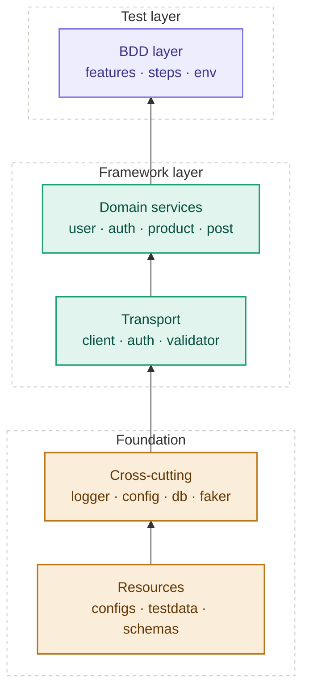

<div align="center">

# Python API Automation Framework

### Capstone Project · Python Automation Course · 2026

**Requests + Behave BDD · Allure Reporting · MySQL Validation**

[](https://www.python.org/)
[](https://requests.readthedocs.io/)
[](https://behave.readthedocs.io/)
[](https://allurereport.org/)
[](https://www.mysql.com/)

</div>

---

## Table of Contents

| Section | What you'll find |
|---|---|
| [Overview](#overview) | What the framework does and why it was built |
| [Demo Video & Screenshots](#demo-video--screenshots) | Watch the walkthrough · see the reports |
| [Test Results](#test-results) | Latest full run summary |
| [Architecture](#architecture) | Layered design + Mermaid diagram |
| [Design Principles](#design-principles) | The six rules that shape the codebase |
| [Tech Stack](#tech-stack) | Every library, tool, and version in use |
| [Folder Structure](#folder-structure) | Full project tree with annotations |
| [API Coverage](#api-coverage) | Endpoints automated, grouped by feature |
| [Configuration](#configuration) | Environment files and MySQL setup |
| [How to Run](#how-to-run) | Commands for every scenario |
| [Reports](#reports) | Allure HTML report generation |
| [Database Verification](#database-verification) | MySQL mirroring and assertions |
| [Tags Reference](#tags-reference) | Every behave tag and what it targets |
| [Docs](#docs) | Companion documents in this folder |
| [Author](#author) | Submission details |

---

## Overview

This is a **production-grade API automation framework** built around the **User Management API** of public REST services. It automates the full **CRUD lifecycle** — create, retrieve, update, delete — while also handling **authentication**, **negative paths**, **contract validation**, and **database mirroring**.

The framework is written entirely in **Python 3.14** and orchestrated by **Behave** (BDD). Every scenario is expressed in **Gherkin**, with a clean separation between *what the test does* (features) and *how the API is called* (services + transport layer). This keeps the test suite readable by non-technical reviewers while remaining maintainable for engineers.

Two public services are used:

- **automationexercise.com** — for real user-management flows (create, login, update, delete, get-by-email)
- **jsonplaceholder.typicode.com** — for contract and negative-path testing

All payloads are generated via **Faker** with **UUID suffixes**, ensuring idempotent runs even when the same scenario executes back-to-back.

---

## Demo Video & Screenshots

<div align="center">

### Demo Walkthrough

[](<!-- ADD CAPSTONE DEMO VIDEO LINK -->)

*Full framework walkthrough — architecture, live test run, Allure report, and database verification.*

</div>

### Screenshots

<div align="center">

**Allure Report — Overview**


**Allure Report — Scenario Detail**


**Test Execution Summary (CLI)**


**MySQL — User Mirror Table**


</div>

> Replace the placeholder paths above with actual screenshot files. Recommended location: `docs/screenshots/`.

---

## Test Results

**Latest full run:**

```
3 features passed,  0 failed, 0 skipped
21 scenarios passed, 0 failed, 0 skipped
91 steps passed,    0 failed, 0 skipped
Took 0min 29.742s
```

**Pre-flight checks (all green):**

| Check | Status |
|---|---|
| AutomationExercise API reachable | HTTP 200 |
| JSONPlaceholder API reachable | HTTP 200 |
| MySQL80 service running | Active |
| Allure CLI installed | 2.46.1 |
| Database seeded | 24 rows |

---

## Architecture

The framework is **layered**, with dependency direction flowing **strictly upward**. Each layer only knows about the layer directly below it — nothing else.



### What each layer does

| Layer | Responsibility | Files |
|---|---|---|
| **Test layer** | Gherkin scenarios + step bindings | `features/*.feature`, `features/steps/*.py`, `features/environment.py` |
| **Framework layer — Domain** | Business actions against APIs — one class per resource | `services/user_service.py`, `auth_service.py`, `product_service.py`, `post_service.py` |
| **Framework layer — Transport** | Raw HTTP calls, auth strategies, assertion helpers | `core/base_client.py`, `core/auth_handler.py`, `core/response_validator.py` |
| **Foundation — Cross-cutting** | Shared utilities used everywhere | `utils/logger.py`, `config_loader.py`, `db_connector.py`, `db_repository.py`, `payload_factory.py`, `schema_loader.py`, `data_reader.py` |
| **Foundation — Resources** | External data and configuration | `configs/*.yaml`, `testdata/*.yaml\|json\|csv`, `schemas/*.json` |

---

## Design Principles

Six rules shape the entire codebase:

1. **Features know nothing about HTTP.** A `.feature` file describes user intent in plain English. It never mentions `GET`, `POST`, or status codes.
2. **Services know nothing about BDD.** Service classes are reusable from any runner — behave, pytest, or a plain script. No step-decorators leak into `services/`.
3. **Assertions live in `ResponseValidator`.** Services return `APIResponse` objects. The validator does the asserting. This keeps services pure and testable.
4. **Endpoints are centralized.** Every URL constant lives in `services/_endpoints.py` — the single source of truth. No endpoint strings scattered across files.
5. **Payloads are idempotent.** Faker generates data for each run, with UUID suffixes appended, so re-running never collides with existing records.
6. **Sensitive fields are masked.** `password`, `token`, `authorization`, `api_key`, and `secret` are scrubbed from logs before any write to disk.

---

## Tech Stack

| Layer | Tool | Version |
|---|---|---|
| Language | Python | 3.14 |
| HTTP client | `requests` | 2.x (Session + retry + timing) |
| BDD framework | `behave` | latest |
| Reporting | Allure CLI | 2.46.1 |
| Data generation | `faker` | latest |
| Database | MySQL | 8.0 |
| DB driver | `mysql-connector-python` | latest |
| Config format | YAML | — |
| Schema validation | JSON Schema | — |
| Test data formats | YAML · JSON · CSV | — |

---

## Folder Structure

```
Capstone_Project/
├── run.py                          CLI runner (--env, --tags, --allure, --clean)
├── behave.ini                      Behave config + Allure formatter registration
├── requirements.txt                Pinned dependencies
├── README.md                       ← you are here
├── README_DETAILED.md              Full walkthrough (500+ lines)
├── .gitignore                      Python + reports + venv
│
├── configs/
│   ├── __init__.py                 Re-exports Config
│   ├── dev.yaml                    Active environment: dev, MySQL creds, base URLs
│   ├── qa.yaml                     QA environment override
│   └── prod.yaml                   Production environment override
│
├── core/
│   ├── __init__.py                 Re-exports BaseClient, APIResponse, etc.
│   ├── base_client.py              Session + retry + masking + timing
│   ├── auth_handler.py             Strategy pattern: NoAuth, Basic, Bearer, ApiKey, Cookie
│   └── response_validator.py       Static assertion helpers (status, schema, time, body)
│
├── services/
│   ├── __init__.py
│   ├── _endpoints.py               Centralized endpoint constants (AEEndpoints, JPEndpoints)
│   ├── user_service.py             create · delete · update · get_user_by_email
│   ├── auth_service.py             verify_login + JSONPlaceholder user profile
│   ├── product_service.py          products · brands · search · negative methods
│   └── post_service.py             JSONPlaceholder CRUD
│
├── utils/
│   ├── __init__.py                 Re-exports all utils
│   ├── config_loader.py            Singleton Config with dotted-path lookup
│   ├── logger.py                   Idempotent logger factory (console + rotating file)
│   ├── data_reader.py              YAML/JSON/CSV + Scenario-Outline helpers
│   ├── db_connector.py             MySQL wrapper (lazy, dict cursor, context manager)
│   ├── db_repository.py            UserRepository CRUD
│   ├── payload_factory.py          Faker-based generators
│   └── schema_loader.py            Cached JSON schema loader
│
├── features/
│   ├── __init__.py                 EMPTY (required by behave)
│   ├── environment.py              Behave hooks + Allure attachments
│   ├── user_management.feature     6 scenarios (create, retrieve, update, delete, schema, DB)
│   ├── authentication.feature      4 outline rows + 2 scenarios (valid login, DELETE 405)
│   ├── product_catalog.feature     8 scenarios (products, brands, search, negatives)
│   └── steps/
│       ├── __init__.py             EMPTY
│       ├── common_steps.py         Shared: status, message, schema, min-products
│       ├── user_management_steps.py User CRUD + DB mirroring
│       ├── auth_steps.py           Login steps
│       └── product_steps.py        Catalog steps
│
├── testdata/
│   ├── users.yaml                  3 valid users
│   ├── invalid_users.yaml          5 negative login cases
│   ├── products.csv                Search terms
│   └── payloads/
│       └── create_user.json        Fallback template
│
├── schemas/
│   ├── user_schema.json
│   ├── product_schema.json         Allows usertype as object OR string (AE quirk)
│   ├── error_schema.json
│   ├── login_response_schema.json
│   └── jsonplaceholder_post_schema.json
│
├── db/
│   ├── schema.sql                  DDL for api_automation_db.user_management
│   └── init_db.py                  Creates database + table
│
├── reports/
│   ├── allure-results/             Raw JSON (input to Allure CLI)
│   └── allure-report/              HTML (output of `allure generate`)
│
├── logs/
│   └── framework.log               Rotating log file
│
└── docs/
    ├── architecture.md             Diagram + data flow
    ├── test_strategy.md            Scope, tags, risks
    ├── demo_script.md              5–7 minute demo plan
    ├── viva_qna.md                 Anticipated viva Q&A
    └── screenshots/                Images used in this README
```

---

## API Coverage

### AutomationExercise — User Management

| Feature | Endpoints Covered |
|---|---|
| Create user | `POST /api/createAccount` |
| Delete user | `DELETE /api/deleteAccount` |
| Update user | `PUT /api/updateAccount` |
| Get user by email | `GET /api/getUserDetailByEmail` |
| Verify login | `POST /api/verifyLogin` |
| Negative login | `POST /api/verifyLogin` (missing parameter, invalid credentials) |

### AutomationExercise — Product Catalog

| Feature | Endpoints Covered |
|---|---|
| List all products | `GET /api/productsList` |
| List all brands | `GET /api/brandsList` |
| Search product | `POST /api/searchProduct` |
| Negative product search | `POST /api/searchProduct` (missing parameter) |
| Unsupported method | `POST /api/productsList` → expects `405` |

### JSONPlaceholder — Contract & CRUD

| Feature | Endpoints Covered |
|---|---|
| Post CRUD | `GET · POST · PUT · PATCH · DELETE /posts/{id}` |
| User profile | `GET /users/{id}` |
| Contract validation | All of the above — validated against JSON schemas |

---

## Configuration

Environment files live in `configs/`. The active environment is selected via `--env` on the CLI, defaulting to `dev`.

**`configs/dev.yaml`:**

```yaml
base_urls:
  automation_exercise: "https://automationexercise.com/api"
  jsonplaceholder: "https://jsonplaceholder.typicode.com"

database:
  host: "localhost"
  port: 3306
  user: "root"
  password: "****"          # YAML-quoted
  name: "api_automation_db"

timeouts:
  request: 30
  retries: 3
```

To switch environments:

```powershell
python run.py --env=qa
```

---

## How to Run

### Activate the virtual environment

```powershell
.\.venv\Scripts\Activate.ps1
```

### Full suite (all scenarios, dev environment)

```powershell
python run.py
```

### Filter by tag

```powershell
python run.py --tags=@smoke
python run.py --tags=@database
python run.py --tags=@negative
```

### Generate Allure report

```powershell
python run.py --allure
allure open reports/allure-report
```

### Clean previous results

```powershell
python run.py --clean
```

### Switch environment

```powershell
python run.py --env=qa
```

### Raw behave (bypassing run.py)

```powershell
behave
behave features/user_management.feature
behave --tags=@contract
```

---

## Reports

Allure collects results during every behave run and writes them to `reports/allure-results/`. The HTML report is generated by:

```powershell
allure generate reports/allure-results -o reports/allure-report --clean
allure open reports/allure-report
```

The report includes:

- Pass/fail breakdown per feature and scenario
- Full step logs with request/response attachments
- Screenshots and JSON payloads (where attached by hooks)
- Timing per step and per scenario
- Environment info and tag filters

> Sensitive values are masked before they reach Allure — passwords and tokens never appear in reports.

---

## Database Verification

The framework mirrors a subset of User Management operations into MySQL so that DB-level assertions can run alongside API assertions.

**Database:** `api_automation_db`
**Table:** `user_management`
**Schema:** `db/schema.sql`

Initialise the database:

```powershell
python db/init_db.py
```

Rows are added automatically when `@database` scenarios run — the repository writes to `user_management` after each successful API create. Assertions like *"the user exists in the database"* then query the same table via `UserRepository`.

---

## Tags Reference

| Tag | Purpose |
|---|---|
| `@smoke` | Fast sanity check — critical paths only |
| `@regression` | Full functional coverage |
| `@negative` | Error paths and invalid inputs |
| `@contract` | Response body validated against JSON schemas |
| `@database` | Scenarios that assert against MySQL |
| `@auth` | Login and authentication flows |
| `@user_mgmt` | Create / read / update / delete user flows |
| `@catalog` | Product and brand catalog flows |

Combine tags with:

```powershell
python run.py --tags=@smoke --tags=@auth
```

---

## Docs

Companion documents inside this folder:

| File | Contents |
|---|---|
| [`README_DETAILED.md`](./README_DETAILED.md) | 500+ line walkthrough — every module explained |
| [`docs/architecture.md`](./docs/architecture.md) | Deep dive on layering + data flow |
| [`docs/test_strategy.md`](./docs/test_strategy.md) | Scope, in-scope APIs, tags, risks |
| [`docs/demo_script.md`](./docs/demo_script.md) | 5–7 minute demo plan for the viva |
| [`docs/viva_qna.md`](./docs/viva_qna.md) | Anticipated questions with prepared answers |

---

## Author

| Field | Details |
|---|---|
| **Name** | `<!-- ADD YOUR FULL NAME -->` |
| **Enrollment No.** | `<!-- ADD ENROLLMENT NUMBER -->` |
| **Class / Section** | `<!-- ADD CLASS & SECTION -->` |
| **Department** | `<!-- ADD DEPARTMENT -->` |
| **Course** | Python Automation |
| **Submission Date** | `<!-- ADD DATE -->` |

---

<div align="center">

**Built with Python · Behave · Requests · Allure · MySQL**

*Dependency flows one way — nothing flows back up.*

</div>
