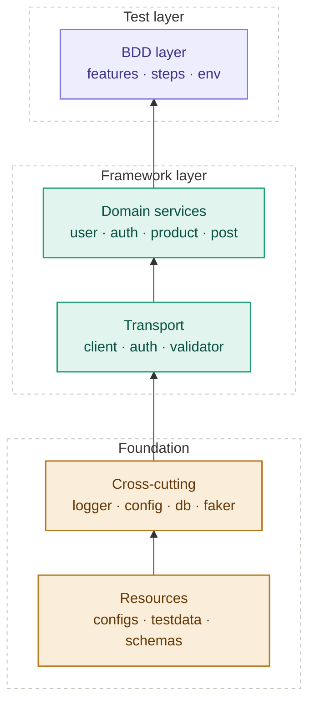

<div align="center">

# 🐍 Python Automation Portfolio

### Capstone Project & Assignment Submissions

**Python Automation Course · 2026**

[](https://www.python.org/)
[](https://selenium.dev/)
[](https://behave.readthedocs.io/)
[](https://pytest.org/)
[](https://robotframework.org/)
[](https://allurereport.org/)

</div>

---

<p align="center">
  <em>This root README is the <b>map</b>. Every project and assignment folder holds its own detailed README.</em>
</p>

<table align="center">
  <tr>
    <td align="center" width="180">📋<br/><b>Task Breakdown</b><br/><sub>What was asked</sub></td>
    <td align="center" width="180">🖼️<br/><b>Screenshots</b><br/><sub>Proof of execution</sub></td>
  </tr>
  <tr>
    <td align="center" width="180">🎥<br/><b>Walkthrough</b><br/><sub>Video explanation</sub></td>
    <td align="center" width="180">📝<br/><b>Code Notes</b><br/><sub>Line-level context</sub></td>
  </tr>
</table>

<p align="center"><sub><b>Skip the scroll</b> — jump straight to any section below</sub></p>

<h2 align="center">📖 Table of Contents</h2>

<p align="center">
  <a href="#-capstone-project"></a>
  <a href="#-assignments-portfolio"></a>
  <a href="#-certificates"></a>
</p>
<p align="center">
  <a href="#-repository-structure"></a>
  <a href="#-quick-start"></a>
  <a href="#-student-information"></a>
  <a href="#-acknowledgments"></a>
</p>

---
## 🏗️ Capstone Project

### Python API Automation Framework
**Requests + Behave BDD · Allure Reporting · MySQL Validation**

A production-grade, layered API automation framework that automates the **User Management API** of public REST services. Built with a strict separation of concerns — BDD features, domain services, transport layer, and cross-cutting utilities — so that features never touch HTTP and services never know about BDD.

<div align="center">

[](./Capstone_Project/README_DETAILED.md)
[](<!-- ADD CAPSTONE DEMO VIDEO LINK -->)
[](<!-- ADD ALLURE REPORT LINK -->)

</div>

---

### 🎯 Overview

The framework validates a complete **CRUD lifecycle** of a user-management API — create, retrieve, update, and delete — while also handling **authentication**, **negative paths**, **contract validation**, and **database mirroring**. Payloads are Faker-generated with UUID suffixes to guarantee idempotent, repeatable runs, and sensitive fields (`password`, `token`, `authorization`, `api_key`, `secret`) are masked before every log write.

**Last full run:**

```
✅ 3 features passed   ·   0 failed
✅ 21 scenarios passed ·   0 failed
✅ 91 steps passed     ·   0 failed
⏱️  Took 0min 29.742s
```

---

### 🧱 Architecture — Layered

Dependency direction flows **one way (upward)**. Each layer only knows about the layer directly below it.


**Key design principles**

- 🧩 **Features know nothing about HTTP** — pure Gherkin in, pure assertions out
- 🧩 **Services know nothing about BDD** — reusable across any runner
- 🧩 **Assertions live in `ResponseValidator`** — never inside services
- 🧩 **Endpoints are centralized** — `services/_endpoints.py` is the single source of truth
- 🧩 **Idempotent payloads** — Faker + UUID suffix on every run
- 🧩 **Automatic masking** — sensitive fields scrubbed before logging

---

### 🛠️ Tech Stack

| Layer | Tools |
|---|---|
| **Language** | Python 3.14 |
| **HTTP Client** | `requests` (Session + retry + timing) |
| **BDD Framework** | `behave` (Gherkin features + step definitions) |
| **Reporting** | Allure 2.46.1 |
| **Data Generation** | Faker |
| **Database** | MySQL 8.0 (dict cursor, context manager) |
| **Config** | YAML (`dev` / `qa` / `prod`) |
| **Schema Validation** | JSON Schema |
| **Test Data** | YAML · JSON · CSV |

---

### 📂 Folder Division (Top Level)

```
Capstone_Project/
├── run.py                  # CLI runner (--env, --tags, --allure, --clean)
├── behave.ini              # Behave config + Allure formatter
├── requirements.txt        # Pinned dependencies
├── README.md               # Brief README
├── README_DETAILED.md      # Full walkthrough (500+ lines)
│
├── configs/                # dev.yaml · qa.yaml · prod.yaml
├── core/                   # base_client · auth_handler · response_validator
├── services/               # user · auth · product · post  (+ _endpoints.py)
├── utils/                  # config_loader · logger · db · payload_factory · schema_loader
├── features/               # *.feature files + steps/
├── testdata/               # users.yaml · invalid_users.yaml · products.csv
├── schemas/                # JSON schemas for contract validation
├── db/                     # schema.sql · init_db.py
├── reports/                # allure-results/ · allure-report/
├── logs/                   # framework.log (rotating)
└── docs/                   # architecture.md · test_strategy.md · demo_script.md · viva_qna.md
```

> 📌 **Note**
> The Capstone_Project folder contains its **own detailed READMEs** covering the full walkthrough, architecture deep-dive, test strategy, demo script, and anticipated viva Q&A. Refer to [`Capstone_Project/README_DETAILED.md`](./Capstone_Project/README_DETAILED.md) for the complete picture.

---

### 🏷️ Tags in Use

`@smoke` · `@regression` · `@negative` · `@contract` · `@database` · `@auth` · `@user_mgmt` · `@catalog`

---

## 📚 Assignments Portfolio

All assignments are organized under four thematic parts. Each row links directly to its source file and an explanatory video.

| # | Part | Assignment | Code | Video |
|:--:|---|---|:--:|:--:|
| 1 | Selenium | **Locators** — Login to saucedemo.com using ID, Name, and XPath strategies | [📄](./Assignments/Part_1_Automation_With_Selenium/assignment_1_locators.py) | [🎥](<!-- ADD VIDEO LINK -->) |
| 2 | Selenium | **Synchronization** — Explicit waits with WebDriverWait (no `time.sleep()`) | [📄](./Assignments/Part_1_Automation_With_Selenium/assignment_2_sync.py) | [🎥](<!-- ADD VIDEO LINK -->) |
| 3 | Selenium | **JavaScript Alerts** — Handle Alert, Confirm, and Prompt dialogs | [📄](./Assignments/Part_1_Automation_With_Selenium/assignment_4_alerts.py) | [🎥](<!-- ADD VIDEO LINK -->) |
| 4 | Selenium | **Web Tables** — Iterate rows/columns, find by string match, extract adjacent value | [📄](./Assignments/Part_1_Automation_With_Selenium/assignment_5_webtables.py) | [🎥](<!-- ADD VIDEO LINK -->) |
| 5 | Selenium | **Windows · Tabs · Frames** — Switch contexts with `switch_to.frame()` and `window_handles` | [📄](./Assignments/Part_1_Automation_With_Selenium/assignment_6_windows_frames.py) | [🎥](<!-- ADD VIDEO LINK -->) |
| 6 | PyTest | **Page Object Model** — BasePage → LoginPage → PyTest tests with separated assertions | [📄](./Assignments/Part_2_Unit_Test_Frameworks/assignment_7_pom/) | [🎥](<!-- ADD VIDEO LINK -->) |
| 7 | PyTest | **Data-Driven Testing** — CSV + `@pytest.mark.parametrize` over multiple login combos | [📄](./Assignments/Part_2_Unit_Test_Frameworks/assignment_8_ddt.py) | [🎥](<!-- ADD VIDEO LINK -->) |
| 8 | PyTest | **HTML Reporting** — Module-scoped fixture + `pytest-html` self-contained report | [📄](./Assignments/Part_2_Unit_Test_Frameworks/assignment_9_pytest_html.py) | [🎥](<!-- ADD VIDEO LINK -->) |
| 9 | Behave | **BDD Framework** — Gherkin scenarios + step definitions for login flows | [📄](./Assignments/Part_3_Python_BDD_Restful_Automations/features/login.feature) | [🎥](<!-- ADD VIDEO LINK -->) |
| 10 | Behave | **Data-Driven API** — POST JSON payloads, validate 201 + response body | [📄](./Assignments/Part_3_Python_BDD_Restful_Automations/assignment_2_api_data_driven.py) | [🎥](<!-- ADD VIDEO LINK -->) |
| 11 | Robot | **Basic Syntax** — SeleniumLibrary keywords for login + inventory verification | [📄](./Assignments/Part_4_Robot_Framework/assignment_1_basic.robot) | [🎥](<!-- ADD VIDEO LINK -->) |
| 12 | Robot | **Variables** — `${VARIABLE}` syntax in the `*** Variables ***` section | [📄](./Assignments/Part_4_Robot_Framework/assignment_2_variables.robot) | [🎥](<!-- ADD VIDEO LINK -->) |
| 13 | Robot | **Custom Keywords** — User-defined keywords with `[Arguments]` + `[Teardown]` | [📄](./Assignments/Part_4_Robot_Framework/assignment_3_custom_keywords.robot) | [🎥](<!-- ADD VIDEO LINK -->) |
> 💡 **Note:** Each assignment folder contains its **own README** with a detailed explanation, screenshots, and a walkthrough video. This root README links directly to the source code and the accompanying video for convenience.

---

## 🏅 Certifications

| # | Certificate | Provider | Date | Certificate |
|:--:|---|---|---|:--:|
| 1 | Python for Automation | Madecraft | September 2026 | [📄 View](./Certificates/Python_for_Automation_Madecraft.pdf) |
| 2 | Selenium WebDriver with Python | Whizlabs | September 2026 | [📄 View](./Certificates/Selenium_WebDriver_Python_Whizlabs.pdf) |
| 3 | Test Automation with Playwright (Python) & Robot Framework | Coursera | September 2026 | [📄 View](./Certificates/Test_Automation_Playwright_Robot_Coursera.pdf) |

---

## 📁 Repository Structure

```
Submission/
├── README.md                           ← you are here
├── Capstone_Project/
│   ├── README.md
│   ├── README_DETAILED.md
│   └── (full framework — see Capstone section)
└── Assignments/
    ├── run_all.ps1
    ├── Part_1_Automation_With_Selenium/
    ├── Part_2_Unit_Test_Frameworks/
    ├── Part_3_Python_BDD_Restful_Automations/
    └── Part_4_Robot_Framework/
```

---

## 🚀 Quick Start

### Capstone_Project

```powershell
cd Capstone_Project
.\.venv\Scripts\Activate.ps1
python run.py                        # all scenarios on dev
python run.py --tags=@smoke          # smoke only
python run.py --tags=@database       # DB verification only
python run.py --allure               # full run + Allure HTML
allure open reports/allure-report    # view report
```

### Assignments

```powershell
cd Assignments
.\venv\Scripts\Activate.ps1
.\run_all.ps1                        # run everything
```

Individual runners:

```powershell
python Part_1_Automation_With_Selenium\assignment_1_locators.py
pytest Part_2_Unit_Test_Frameworks\assignment_8_ddt.py
behave Part_3_Python_BDD_Restful_Automations
robot  Part_4_Robot_Framework
```
---

## 👤 Student Information

| Field | Details |
|---|---|
| **Name** | `<!-- ADD YOUR FULL NAME -->` |
| **Enrollment No.** | `<!-- ADD ENROLLMENT NUMBER -->` |
| **Class / Section** | `<!-- ADD CLASS & SECTION -->` |
| **Department** | `<!-- ADD DEPARTMENT -->` |
| **Course** | Python Automation |
| **Submission Date** | `<!-- ADD DATE -->` |

---
---

## 🙏 Acknowledgments

- Course instructors and mentors for the structured syllabus
- [automationexercise.com](https://automationexercise.com/) & [jsonplaceholder.typicode.com](https://jsonplaceholder.typicode.com/) — public APIs used for testing
- [saucedemo.com](https://www.saucedemo.com/) — practice site for Selenium assignments
- Open-source communities behind `requests`, `behave`, `pytest`, `robotframework`, and `allure`

---

<div align="center">

**⭐ Built with Python, patience, and a lot of green test runs.**

`<!-- ADD YOUR NAME -->` · `<!-- ADD ENROLLMENT NUMBER -->` · `<!-- ADD DEPARTMENT -->`

</div>
