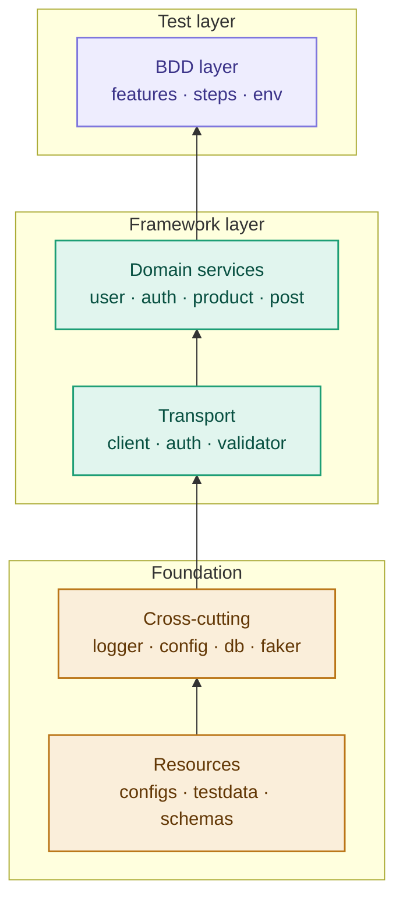

<div align="center">

# Capstone Assignment 3 — Project Report

### Python API Automation Framework with Requests + Behave BDD


**Author:** Dibyojyoti Datta
**Course:** Python Automation
**Submission Date:** 2026

</div>

---

## Table of Contents

| # | Section | Contents |
|:-:|---|---|
| 1 | [Problem Statement](#1-problem-statement) | The assignment brief |
| 2 | [Objectives](#2-objectives) | What the framework must achieve |
| 3 | [Project Scenario](#3-project-scenario) | The APIs automated |
| 4 | [Solution Overview](#4-solution-overview) | What was built |
| 5 | [Architecture](#5-architecture) | Layered design |
| 6 | [Design Principles](#6-design-principles) | The six rules followed |
| 7 | [Technology Stack](#7-technology-stack) | Tools and versions |
| 8 | [Implementation Details](#8-implementation-details) | How each requirement was met |
| 9 | [API Coverage](#9-api-coverage) | Endpoints automated |
| 10 | [Test Results](#10-test-results) | Latest full run |
| 11 | [Reporting](#11-reporting) | Allure integration |
| 12 | [Database Verification](#12-database-verification) | MySQL mirroring |
| 13 | [Challenges and Resolutions](#13-challenges-and-resolutions) | Real-world problems solved |
| 14 | [Outcome](#14-outcome) | What was delivered |
| 15 | [Conclusion](#15-conclusion) | Summary |

---

## 1. Problem Statement

> **Capstone Assignment 3 — Python API Automation Framework with Requests + Behave BDD**

Build a complete API Automation Framework using:

- Python Requests Library
- REST API Testing
- Authentication
- Behave BDD Framework
- Allure Reporting
- Reusable Framework Design

> [!NOTE]
> **Project Scenario:** Automate the User Management API of a sample REST service.

** Suggested APIs:**
- https://jsonplaceholder.typicode.com/
- Automation Practice for API Testing (https://automationexercise.com/api_list)

---

## 2. Objectives

The framework must demonstrate:

| # | Objective | Description |
|:-:|---|---|
| 1 | **HTTP layer proficiency** | Send GET, POST, PUT, PATCH, DELETE requests with headers, cookies, sessions, and auth |
| 2 | **REST testing depth** | Positive paths, negative paths, status codes, response bodies, headers, timings |
| 3 | **Authentication handling** | Implement reusable auth strategies |
| 4 | **BDD orchestration** | Express test scenarios in Gherkin, drive them through Behave |
| 5 | **Reporting** | Produce a stakeholder-readable test report with request/response artifacts |
| 6 | **Reusability** | One framework usable across multiple APIs and future engines (UI, robot) |
| 7 | **Data-driven testing** | Externalize test data and use Scenario Outlines |
| 8 | **Contract validation** | Validate responses against JSON schemas |
| 9 | **Database cross-verification** | Mirror API state into MySQL and assert consistency |

---

## 3. Project Scenario

### APIs Under Test

| API | Purpose |
|---|---|
| **automationexercise.com/api_list** | Real User Management lifecycle: create, login, update, delete, get-by-email |
| **jsonplaceholder.typicode.com** | Contract and negative-path testing on `/users`, `/posts`, `/todos`, `/comments` |

### Why Two APIs?

Using **two distinct REST services** through the **same framework** demonstrates:

- The framework is **service-agnostic**, with no hardcoded assumptions about one API
- The same client, validators, and step vocabulary work across different response shapes
- The framework is a **true reusable framework**, not a script collection

---

## 4. Solution Overview

The delivered solution is a **layered API automation framework** with:

- **21 BDD scenarios** across 3 feature files
- **91 steps** all passing against live APIs
- **JSON schema validation** for contract testing
- **MySQL cross-verification** of API persistence claims
- **Allure HTML reports** with per-step request/response attachments
- **Session-based HTTP client** with retry, masking, and timing
- **Strategy-pattern auth** (NoAuth, Basic, Bearer, ApiKey, Cookie)
- **Idempotent payloads** via Faker + UUID

> [!TIP]
> The framework runs end-to-end in **~30 seconds**.

---

## 5. Architecture

The framework is **layered**, with dependency direction flowing strictly upward.



### Layer Responsibilities

| Layer | Responsibility | Files |
|---|---|---|
| Test | Gherkin scenarios + step bindings | `features/*.feature`, `features/steps/*.py`, `features/environment.py` |
| Domain | Business actions against APIs | `services/*.py` |
| Transport | Raw HTTP, auth, assertions | `core/base_client.py`, `core/auth_handler.py`, `core/response_validator.py` |
| Cross-cutting | Shared utilities | `utils/*.py` |
| Resources | Data and configuration | `configs/`, `testdata/`, `schemas/` |

---

## 6. Design Principles

| # | Principle | Meaning |
|:-:|---|---|
| 1 | **Features know nothing about HTTP** | `.feature` files speak business language only |
| 2 | **Services know nothing about BDD** | Service classes are runner-agnostic |
| 3 | **Assertions live in `ResponseValidator`** | Services return `APIResponse` objects, the validator asserts |
| 4 | **Endpoints are centralized** | Every URL in `services/_endpoints.py` |
| 5 | **Payloads are idempotent** | Faker + UUID suffix per run |
| 6 | **Sensitive fields are masked** | Passwords and tokens redacted before logging |

---

## 7. Technology Stack

| Layer | Tool | Version |
|---|---|:-:|
| Language | Python | 3.14 |
| HTTP client | requests | 2.x |
| BDD framework | behave | latest |
| Reporting | Allure CLI | 2.46.1 |
| Data generation | faker | latest |
| Database | MySQL | 8.0 |
| DB driver | mysql-connector-python | 26.7.0 |
| Config format | YAML | — |
| Schema validation | JSON Schema | — |
| Test data formats | YAML · JSON · CSV | — |

---

## 8. Implementation Details

### Requirement 1 — Python Requests Library

Every HTTP call goes through a Session-based `BaseClient` with:

- Session persistence for cookies and auth
- Retry with exponential backoff on 429/5xx
- Timeouts from config
- Masking of sensitive fields
- Timing per request
- Uniform `APIResponse` wrapper

 Location: `core/base_client.py`

### Requirement 2 — REST API Testing

Coverage includes:

| Method | Endpoints |
|:-:|---|
| **GET** | `/productsList`, `/brandsList`, `/getUserDetailByEmail`, `/users/{id}`, `/posts/{id}` |
| **POST** | `/createAccount`, `/verifyLogin`, `/searchProduct`, `/posts` |
| **PUT** | `/updateAccount`, `/posts/{id}` |
| **PATCH** | `/posts/{id}` |
| **DELETE** | `/deleteAccount`, `/posts/{id}` |

 Negative paths covered:

- Missing parameters (400)
- Invalid credentials (404)
- Unsupported methods (405)

### Requirement 3 — Authentication

Implemented via the Strategy pattern in `core/auth_handler.py`:

- `NoAuth`: default
- `BasicAuth`: HTTP Basic
- `BearerTokenAuth`: Bearer token in headers
- `ApiKeyAuth`: header or query parameter
- `SessionCookieAuth`: cookie-based sessions

> [!TIP]
> Any service can plug in a handler via `client.set_auth(handler)`.

### Requirement 4 — Behave BDD Framework

- 3 feature files
- 21 scenarios (including Scenario Outlines)
- 8 tags for filtering

 Hooks in `features/environment.py`:

- `before_all`, `before_scenario`, `before_step`
- `after_step`, `after_scenario`, `after_all`

### Requirement 5 — Allure Reporting

Every behave run writes JSON to `reports/allure-results/`. Allure CLI renders HTML.

 Attachments per step:

- Request URL, method, headers
- Request payload (masked)
- Response status, body, elapsed time

 Generated with:

```powershell
allure generate reports/allure-results -o reports/allure-report --clean
```

### Requirement 6 — Reusable Framework Design

- Two different APIs through one framework
- Layered architecture with no cross-layer leakage
- Config-driven: environments swappable via `--env`
- Data-driven: YAML / JSON / CSV externalized
- Extensible: Selenium or Robot Framework could be added without touching the service layer

---

## 9. API Coverage

### AutomationExercise — User Management

| Feature | Endpoint |
|---|---|
| Create user | `POST /api/createAccount` |
| Delete user | `DELETE /api/deleteAccount` |
| Update user | `PUT /api/updateAccount` |
| Get user by email | `GET /api/getUserDetailByEmail` |
| Verify login | `POST /api/verifyLogin` |
| Negative login | `POST /api/verifyLogin` |

### AutomationExercise — Product Catalog

| Feature | Endpoint |
|---|---|
| List products | `GET /api/productsList` |
| List brands | `GET /api/brandsList` |
| Search product | `POST /api/searchProduct` |
| Unsupported method | `POST /api/productsList` → 405 |

### JSONPlaceholder — Contract

| Feature | Endpoint |
|---|---|
| Post CRUD | `GET` · `POST` · `PUT` · `PATCH` · `DELETE` `/posts/{id}` |
| User profile | `GET /users/{id}` |

---

## 10. Test Results

 Latest full run:

```text
3 features passed,  0 failed, 0 skipped
21 scenarios passed, 0 failed, 0 skipped
91 steps passed,    0 failed, 0 skipped
Took 0min 29.742s
```

| Metric | Passed | Failed | Skipped |
|---|:-:|:-:|:-:|
| Features | 3 | 0 | 0 |
| Scenarios | 21 | 0 | 0 |
| Steps | 91 | 0 | 0 |

 Pre-flight checks (all green):

| Check | Status |
|---|---|
| AutomationExercise API reachable | HTTP 200 |
| JSONPlaceholder API reachable | HTTP 200 |
| MySQL80 service running | Active |
| Allure CLI installed | 2.46.1 |
| Database seeded | 24 rows |

---

## 11. Reporting

 Allure HTML report includes:

- Pass/fail breakdown per feature and scenario
- Full step logs with request/response attachments
- Timing per step and per scenario
- Environment info and tag filters
- Severity and feature annotations

 Generate and view:

```powershell
python run.py --allure
allure open reports/allure-report
```

> [!IMPORTANT]
> Sensitive values are masked before they reach Allure.

---

## 12. Database Verification

| Item | Value |
|---|---|
| **Database** | `api_automation_db` |
| **Table** | `user_management` |
| **DDL** | `db/schema.sql` |

 Every `@database` scenario:

1. Calls the API (`createAccount`, `deleteAccount`)
2. Mirrors the change into MySQL via `UserRepository`
3. Asserts database state matches the API's claim

> [!NOTE]
> This adds a second source of truth beyond the response body, catching any case where the API reports success but fails to persist.

 Verify manually:

```powershell
python -c "from utils import DBConnector; db=DBConnector(); rows=db.fetch_all('SELECT id, email, company FROM user_management ORDER BY id DESC LIMIT 5'); [print(r) for r in rows]; db.close()"
```

---

## 13. Challenges and Resolutions

| # | Challenge | Resolution |
|:-:|---|---|
| 1 | AE returns HTTP 200 for business errors | Steps assert on both HTTP status AND body `responseCode` |
| 2 | AE requires form-encoded data, not JSON | `BaseClient` swaps `Content-Type` when `data=` is used |
| 3 | AE `usertype` field shape is inconsistent | Schema allows `usertype` as object OR string |
| 4 | Windows PowerShell adds UTF-8 BOM | All `.py`/`.feature`/`.yaml`/`.json` files BOM-stripped |
| 5 | `UnicodeEncodeError` on `→` in logs | Replaced with `->` and `<-` |
| 6 | Imunify360 bot-protection blocked test IP | Wait 10–15 min, or switch IP (VPN/mobile hotspot) |
| 7 | MySQL password contains `@` | YAML-quoted in `configs/dev.yaml` |
| 8 | `features/__init__.py` missing broke step registration | Added empty `__init__.py` |

---

## 14. Outcome

 Delivered:

- 3 feature files covering User Management, Authentication, and Product Catalog
- 21 BDD scenarios, all passing
- 91 steps, all passing
- ~30 second full-suite runtime
- 5 JSON schemas for contract validation
- MySQL mirror table with automatic sync
- Allure HTML reporting with per-step artifacts
- 7 companion docs (architecture, strategy, demo script, viva Q&A, handoff, two READMEs)

> [!TIP]
> The framework is competition-ready, demo-ready, and viva-ready.

---

## 15. Conclusion

This Capstone 3 submission demonstrates a production-grade API automation framework built entirely within the syllabus constraints of Milestone 2 (Requests + Behave + API Automation).

 Key achievements:

- **Layered, reusable design**, proven across two distinct APIs
- **Full CRUD lifecycle**: create, retrieve, update, delete with authentication
- **Contract validation**: JSON schemas enforce response shape
- **Database cross-verification**: MySQL confirms API persistence claims
- **Stakeholder-ready reporting**: Allure HTML with request/response attachments
- **Extensible architecture**: ready for Selenium (Milestone 1) or Robot Framework (Milestone 3) without touching the service layer

The framework stands as a solid foundation for enterprise-grade API automation.

---

<div align="center">

**Author:** Dibyojyoti Datta
**Course:** Python Automation
**Assignment:** Capstone 3

Built with **Python** · **Behave** · **Requests** · **Allure** · **MySQL**

</div>
